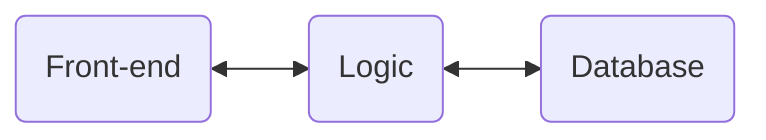

# Demo: Containerised Web Stacks

Example web stacks that are containerised. This repository uses Docker and Compose to build and manage its containers. This repository has the following demos:

Demo | Description
---|---
[Docker Compose](./docker-compose%20basics/) | Test your Docker installation with a basic Docker Compose example.
[Dockerfile and Docker Compose](./dockerfile-compose%20basics/) | Build a container image of a simple app and run the container image.
[Container Isolation and Docker Compose](./express-node%20Hello%20World/) | Build a basic NodeJS and ExpressJS web application and view the web response in a web browser, demonstrating container isolation.
[Docker Compose and Multiple Containers (Mongo-Express-Node web stack)](./mongo-express-node%20stack/) | Build a web application (NodeJS and ExpressJS) in a container which communicates with a database (Mongo) in another container. This demonstrates the basic principles involved in containerising web stacks.

Each demo builds upon the previous one.

## What is "Docker Compose"?

Containers are software/code that is packaged into "[Standardized Units for Development, Shipment and Deployment](https://www.docker.com/resources/what-container/)". [Docker Compose](https://docs.docker.com/compose/) is a tool for defining and running multi-container applications. Containers are important for [reliably sharing, testing, and deploying](https://www.ibm.com/blog/the-benefits-of-containerization-and-what-it-means-for-you/) applications, and using Compose enables containers to be easily shared and run together.

For example, a simple web application could be split into a few containers and shared (and tested) on all development team members' computers, if needed:

<!-- Textual diagram (if Mermaid.js not available) -->
<!-- [Front-end] <-> [Logic] <-> [Database] -->

Compose files are written in [YAML](https://yaml.org/), a common language often used to write configuration files.
