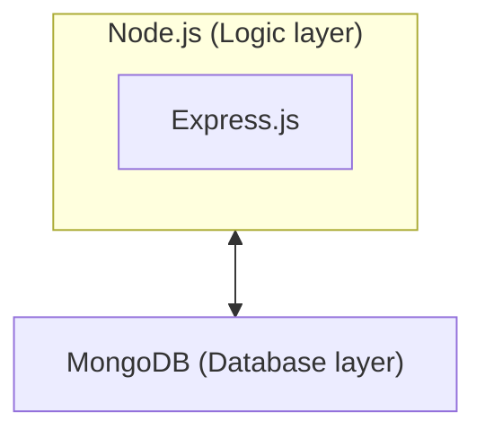

# Docker Compose and Multiple Containers (Mongo-Express-Node web stack)

This example demonstrates how multiple containers communicate with each other.

## Example Web Application

The example web application in this demo is a basic web stack. It does not contain any front-end code/components, for simplicity, so it is therefore not a full web stack such as the [`MERN`](https://www.mongodb.com/mern-stack) (R=React) and [`MEAN`](https://www.mongodb.com/mean-stack) (A=Angular) web stacks.

This demo web stack is made up of MongoDB, Express.js, and Node.JS:

- [Node.js](https://nodejs.org/) — A JavaScript runtime environment.
- [Express.js](http://expressjs.com/) — Web application framework.
- [MongoDB](https://www.mongodb.com/) — Document-oriented database.

There will only be two containers, one for MongoDB and one for the NodeJS application. Express.js will be a dependency of the example application:



<!-- Textual diagram (if Mermaid.js not available) -->
<!-- [Node.js (+ Express.js)] <-> [MongoDB] -->

_An important side note #1_:
The application has been hard-coded to use the docker-compose container name (`db`) for the database instead of `127.0.0.1` or `localhost`, which is what you would have used if you had the database installed directly on the host computer (i.e., not in a container). This application will throw a Connection Refused error (after a ~30-second delay) if you try and run the app directly with `node app.js` unless you have MongoDB installed—the application won't be able to "see" the database. However, this will not happen with Compose file in this demo, which is the primary purpose of this demo series.

_An important side note #2_:
The database queries are asynchronous. Some [`async`/`await`](https://developer.mozilla.org/en-US/docs/Web/JavaScript/Reference/Statements/async_function) keywords have been added to the example [app.js](./app.js). This demo is not a Node tutorial, but be mindful that interactions with any database in any language are often concurrent/asynchronous.

```js
app.get('/', async (req, res) => {
  // Get Students from the database
  const students = JSON.stringify(await getStudents());
  // Send web response
  res.send('Hello World! This is a web response. Node and Express (Logic layer) are working!<br><br>Database contents:<br>' + students);
});
```

### Containerising the Web Application

Building upon the previous demo, the [Dockerfile](./Dockerfile) has not changed at all. Though the app that the Dockerfile places into a container image has been updated with code specific for initialising the database, seeding it with data, and querying—seeding with data and querying is for demonstrating that the connection to the DB works.

The app contains a URI of the database location. If you had Mongo installed on the same computer as your code, it would look like this:

```js
const uri = 'mongodb://localhost:27017';
```

As mentioned above, we have updated it to not point at localhost as the Mongo container cannot be seen there. Instead, we replace `localhost` with the Docker Compose container name for the database. In this demo, the images have been given the names `app` and `db`:

```yml
# docker-compose.yml
services:
  app:
    # ...
  db:
    # ...
```

Therefore the connection URI now appears like this in the [app.js file](./app.js):

```js
const uri = 'mongodb://db:27017';
```

The [app](./app.js) uses the Node package `mongodb` (`npm install mongodb`) which is the driver for the database, not the database software itself. To get the database, we have updated [docker-compose.yml](./docker-compose.yml) to include the following:

```yml
services:
  app:
    # ...
    depends_on:
      - db
  db:
    image: mongo:7.0
    ports:
      - "27017:27017"
```

The new container named `db` is added, which uses the [`mongo` image](https://hub.docker.com/_/mongo/) and maps Mongo's ports so the web application can interact with the database. The `image` also specifies the version to use (`mongo:7.0`), which is good practice—if an image is updated by its owner and you update or redeploy your whole Compose project, there are risks of receiving an updated image with possible breaking changes.

The previous `app` container has been updated to add the `depends_on` instruction, which prevents the `app` from starting until the `db` container is running.

Please note that this demo lets Docker manage the database files. If you would like the database files stored on the host computer or a networked drive, read the documentation for [where to store data](https://hub.docker.com/_/mongo/) on Mongo's Docker Hub page. It contains instructions and describes any caveats.

### Running this Stack with Compose

Now run `docker compose up` in your terminal to see the application be built, and `app` and Mongo `db` run as containers. You will see the terminal output include `Example app listening on port 3000` and now also `Connected to MongoDB`.

You may have noticed that the terminal output prefixes the containers' terminal output with the containers name, like this:

```zsh
app-1  | Connected to MongoDB
db-1   | ...
db-1   | ...
```

This should make it easier to see output from all containers in one place and more easily identify terminal output from the app to see if it is working correctly, for example.

Now open the web application in a web browser by navigating to [http://localhost:3000/](http://localhost:3000/). It should show: `Hello World! This is a web response. Node and Express (Logic layer) are working!`. That response should also include some JSON formatted data to confirm the Database is working. If it is not working, you will only see `Database contents: {}`.

Note that the first time you run this command, the application image is built (which also downloads dependencies), as well as downloading the database image. Subsequent runs should use the cache of the database image unless there is an update.

Don't forget to close the application when you are done by typing `CTRL+C` in the terminal to force it to quit.
